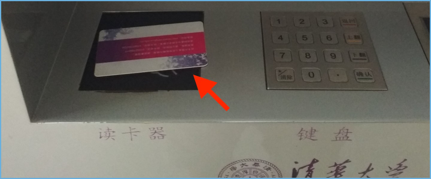
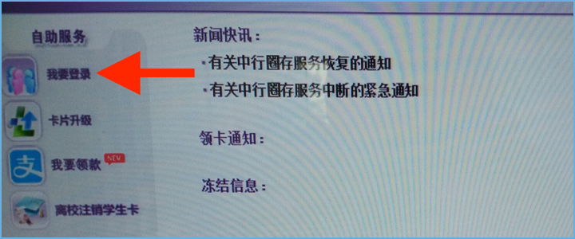
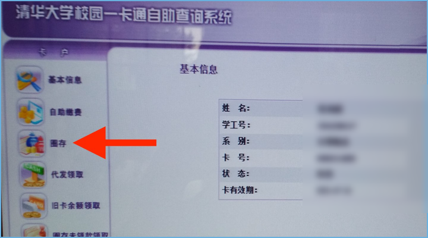

Add money to your Student ID
=============================

There are terminals located at almost every dining hall on campus as well as at the North end of ``C楼``. In order to add money to your Student ID, you need to have a Bank of China account connected to your card. The branch_ at ``C楼`` can help you set one up (be sure to bring your **Passport** and **Student ID**).

1. Place your Student ID on the card reader
--------------------------------------------

2. Tap the sign in icon in the upper left corner
-------------------------------------------------
The sign in ``我要登录`` button is located at the top of the sideboard on the left.

3. Enter password
-------------------
The default password is the last six digits of your passport number.

If your passport number is less than six digits, add zeros to the front to pad it to six digits (e.g. "123" becomes "000123").

4. Tap ``圈存`` (third icon from the top on the left menu)
---------------------------------------------------------------

5. Enter amount to transfer to card
-------------------------------------
Funds are transferred instantly from your Bank of China account to your Student ID.

//todo get picture

6. Tap ``确认`` and then...
-----------------------------
// todo get picture

7. Don't forget to sign out
----------------------------
Tap the sign out ``TODO`` button in the lower left corner.

.. _branch: http://j.map.baidu.com/W9HxC
