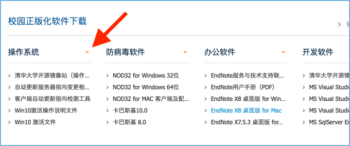

Free software
=============

There's a ton of free software downloads (Word, Excel, Powerpoint, Windows 10 activation keys, and more) buried in the nested menus on info.tsinghua_.

.. note:: Some of the software (e.g. Visual Studio Pro, Excel, Powerpoint) is in Chinese. Generally, they have the same functionality as the English versions, but may be a bit of a hassle to use for those who don't speak Chinese. I'll update this article, if I find a way to swap languages for the MS Office apps.

1. Sign in to info.tsinghua_ and then search the landing page (Cmd + F) for ``软件资源``.

.. image:: free-software-startpage.png

2. Hover your mouse over the ``软件资源`` item in the sidebar on the left and click ``软件资源`` (same name) from the popup menu.

You should land here (see below)...

Software available for download is sorted by "type".

3. Click the orange dropdown arrow to the right of the title in each column to view all the downloads available for that type.

Here's a quick table that should get you going in the right direction.

+-------------------+------------+----------------------------+
| English           | Chinese    | Example                    |
+===================+============+============================+
| Operating Systems | 操作系统   | Windows 10 activation keys |
+-------------------+------------+----------------------------+
| AntiVirus         | 反病毒软件 | Kaspersky, NOD32           |
+-------------------+------------+----------------------------+
| Office            | 办公软件   | Word, Excel, Powerpoint    |
+-------------------+------------+----------------------------+
| Developer         | 开发软件   | Visual Studio Pro          |
+-------------------+------------+----------------------------+
| Math/Stat         | 计算软件   | Matlab                     |
+-------------------+------------+----------------------------+

.. _info.tsinghua: http://info.tsinghua.edu.cn/
