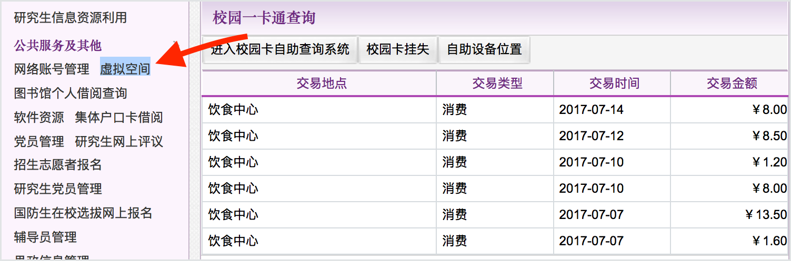
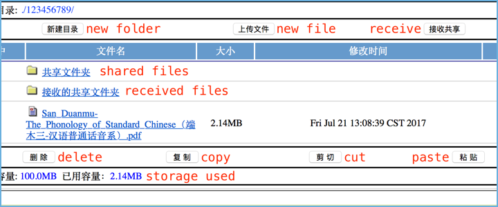

Free storage & file sharing
=================================

Google Drive or Dropbox aren't always easy to get to. When you're connected to Tsinghua's network you can upload and share files using info.tsinghua_. If you're off campus, you can access them using the school's SSL VPN (you'll get redirected there automatically if you try to access info.tsinghua_ while off campus).

Set up
------
1. Sign in to info.tsinghua_ and search the landing page (Cmd + F) for ``虚拟空间``. Click the highlighted item on the left sidebar.

2. If you agree to the terms and conditions, click the ``同意`` button on the right.

You should land here (see below)...

Usage
------

**Upload a file**

1. Navigate to the directory you want the file to land in

2. Click the ``上传文件`` button (middle button in the top row)

3. From the popup, click ``Choose file`` and navigate to your target file

4. Click the ``上载`` button on the right

**Share a file**

This article is a stub.

**Receive a file**

This article is a stub.

.. _info.tsinghua: http://info.tsinghua.edu.cn/
